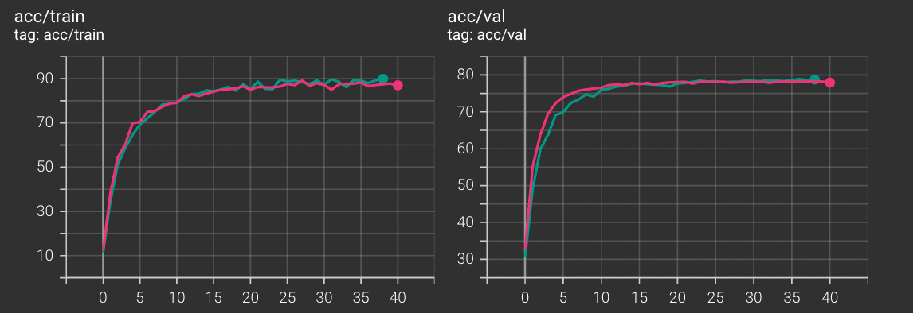
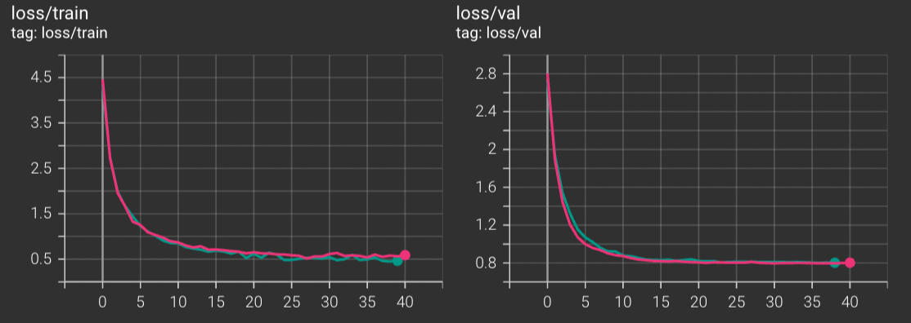
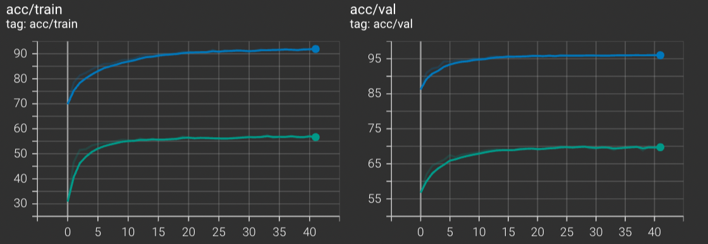
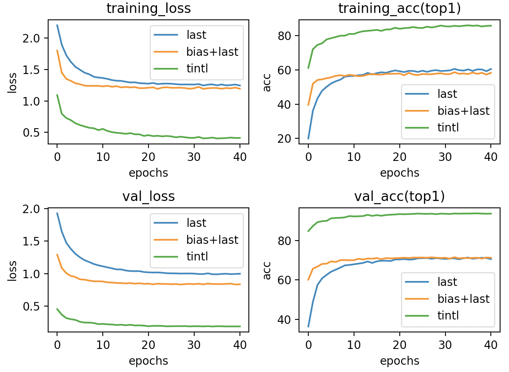
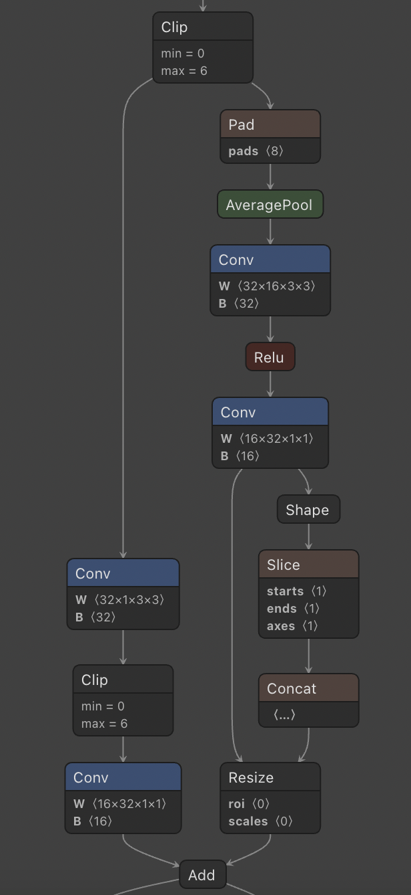
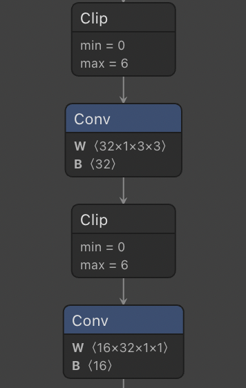
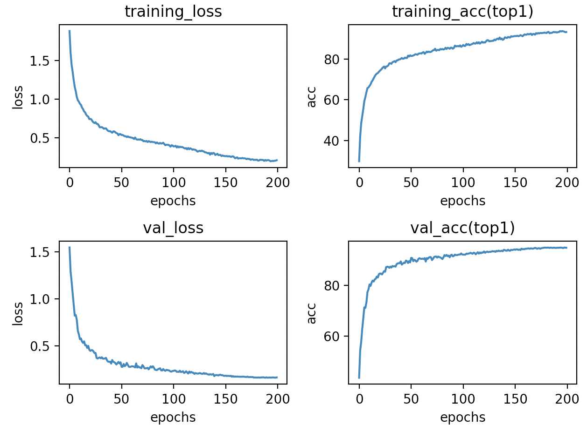
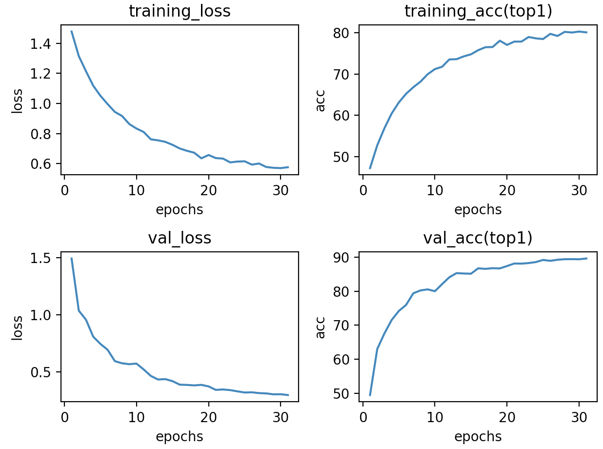
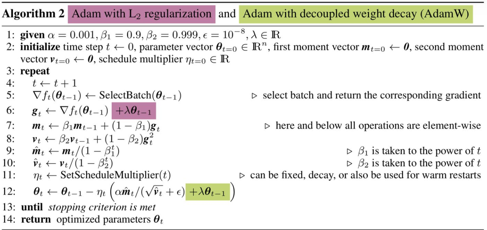
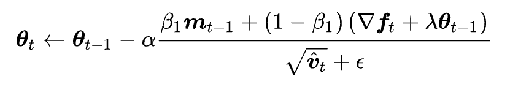

# Report of Finetune

# Menu
- [Report of Finetune](#report-of-finetune)
- [Menu](#menu)
- [Settings](#settings)
- [Results(separate or strategy)](#resultsseparate-lr-strategy)
  - [Table](#table)
- [Strategy Compare](#strategy-compare)
  - [Standard Fine-tuning vs Separate Lr](#standard-fine-tuning-vs-separate-lr)
    - [Result](#result)
    - [CIFAR10](#cifar10)
    - [CUB200](#cub200)
  - [Separate Lr vs Fine-tuning last-3](#separate-lr-vs-fine-tuning-last-3)
    - [CIFAR10](#cifar10-1)
  - [tinyl, FT-Last(CIFAR10)](#tinytl-ft-lastcifar10)
    - [memory cost](#memory-cost)
    - [curve](#curve)
    - [arch](#arch)
      - [lite-residual](#lite-residual)
      - [original backbone](#original-backbone)
- [Train-from-scratch vs Finetune](#train-from-scratch-vs-finetune)
  - [](#)
  - [](#-1)


# Settings

Arch: MobileNetV2

Dataset:CIFAR10,CUB200,CAR196,FOOD101,CIFAR100

Strategy: Finetune the whole layer, finetune last-3-layers, feature extractor, tinytl, separate LR

Pretrained model: Imagenet

Method: reinitialize classifiers

# Results(separate strategy)

## Table

| Dataset                     | Val_acc%(top1) |
| --------------------------- | -------------- |
| Cifar10(whole layer & Adam) | 96.224         |
| CIfar10(tinytl & Adam)      | 93.6           |
| Cifar10(bias & Adam)        | 71.2           |
| Cifar10(train-from-scratch) | 94.8           |
| Car196                      | 87.295         |
| Food101                     | 81.124         |
| Cifar100                    | 73.242         |
| CUB200                      | 78.141         |
| Imagenet                    | 70.241         |
|                             |                |

# Strategy Compare

Since Imagenet is too slow to train, I use CIFAR10 to implement these strategy. All parameters are the same, lr, weight decay, and others.

## Standard Fine-tuning vs Separate Lr 

Standard Fine-tuning

```python
                optimizer = torch.optim.Adam(model.parameters(), args.lr,
                                             weight_decay=args.weight_decay)
```

separate lr 

```python
            classifier_map = list(map(id, model.classifier.parameters()))
            low_map = list(map(id, model.features[-5:]))
            classifier_params = filter(lambda p: id(
                p) in classifier_map, model.parameters())
            low_params = filter(lambda p: id(p) in low_map, model.parameters())
            deep_params = filter(lambda p: id(
                p) not in low_map+classifier_map, model.parameters())
            optimizer = torch.optim.Adam([{'params': classifier_params}, {
                                         'params': low_params, 'lr': args.lr*0.6}, {'params': deep_params, 'lr': args.lr*0.4}], lr=args.lr)
```

### Result

### CIFAR10

Blue curve: separate LR 

Orange curve: Standard Fine-tuning


### CUB200

Pink curve: separate LR 

Green curve: Standard Fine-tuning





It could be inferred that using separate LR, which is small or for deep layers gets better results in validation datasets compared to Standard Fine-tuning.

This is similar to this article,https://arxiv.org/pdf/1811.08737.pdf.


## Separate Lr vs Fine-tuning last-3 

### CIFAR10

green curve: Fine-tuning last-3 

blue curve: separate LR


No doubt Fine-tuning last-3 is a bad choice for MobileNetV2 in CIFAR!

## tinytl, FT-Last(CIFAR10)

### memory cost

Batchsize = 1,model: MobileNetV2

| Method      | activation cost(batch size = 1, n_groups = 2) | activation cost(batch size = 64, n_groups = 2) |
| ----------- | --------------------------------------------- | ---------------------------------------------- |
| FT-Full     | 1756MB                                        | 6225MB                                         |
| TinyTL+last | 849MB                                         | 3125MB                                         |
| FT-Last     | 1157MB                                        | 5426MB                                         |

### curve



### arch

#### lite-residual



#### original backbone




# Train-from-scratch vs Finetune

In this section, I choose the different layers with separate lr finetune method shown above.

## Train from scratch

### sgd+CosineAnnealingLR




### Adam+ expdecay



I stop this because in epoch 30, lr<1e-5

Why Adam is worse than sgd?



You could find that if we get line 6,7,8 into 12



# gradient-checkpoint

## code

```python
class CheckpointFunction(torch.autograd.Function):
    @staticmethod
    def forward(ctx, run_function, length, *args):
        ctx.run_function = run_function
        ctx.input_tensors = list(args[:length])
        ctx.input_params = list(args[length:])
        with torch.no_grad():
            output_tensors = ctx.run_function(*ctx.input_tensors)
        return output_tensors

    @staticmethod
    def backward(ctx, *output_grads):
        for i in range(len(ctx.input_tensors)):
            temp = ctx.input_tensors[i]
            ctx.input_tensors[i] = temp.detach()
            ctx.input_tensors[i].requires_grad = temp.requires_grad
        with torch.enable_grad():
            output_tensors = ctx.run_function(*ctx.input_tensors)
        input_grads = torch.autograd.grad(output_tensors, ctx.input_tensors + ctx.input_params, output_grads, allow_unused=True)
        return (None, None) + input_grads
```

```python
class checkpoint_segment(nn.Module):
    def __init__(self,segment) -> None:
        super(checkpoint_segment,self).__init__()
        self.segment = segment
    def forward(self,x):
        if x.requires_grad == False:
            print("could not use checkpoint at this segment")
        x = checkpoint(self.segment,x)
        return x
    @staticmethod
    def insert_checkpoint(segment):
        segment = checkpoint_segment(segment)
        return segment
```


## result

Model:MobileNetV2

inputsize:3*224 *224

Implement checkpoint to all InvertedResidual block

| batch_size | memory cost(before) | memory cost(after) |
| ---------- | ------------------- | ------------------ |
| 1          | 923MB               | 877MB              |
| 16         | 2183MB              | 1473MB             |

