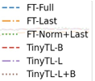
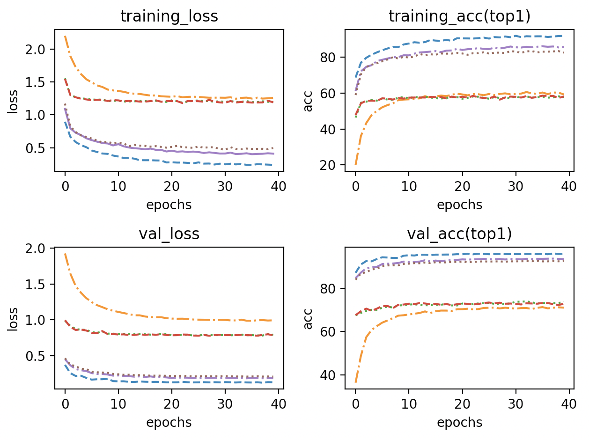

# Experiment

## 1 Setup

## 1.1 Dataset

Following the common practice, we use ImageNet as the pretraining dataset and transfer it to the CIFAR10 classification task. We use parameters provided on torchvision.

## 1.2 Model Architecture

Though TInyTL provides ProxylessNAS-Mobile, I choose MobileNetV2 as my backbone. For each InvertedResidual Block, we inserted with a lite residual module presented in https://proceedings.neurips.cc/paper/2020/file/81f7acabd411274fcf65ce2070ed568a-Paper.pdf. The group size is 2, and the kernel size is 5. The residual module code is shown below.

```python
class LiteResidualModule(nn.Module):

    def __init__(self, main_branch, in_channels, out_channels,
                 expand=1.0, kernel_size=3, act_func='relu', n_groups=2,
                 downsample_ratio=2, upsample_type='bilinear', stride=1):
        super(LiteResidualModule, self).__init__()
        self.main_branch = main_branch
        self.lite_residual_config = {
            'in_channels': in_channels,
            'out_channels': out_channels,
            'expand': expand,
            'kernel_size': kernel_size,
            'act_func': act_func,
            'n_groups': n_groups,
            'downsample_ratio': downsample_ratio,
            'upsample_type': upsample_type,
            'stride': stride,
        }
        kernel_size = 1 if downsample_ratio is None else kernel_size
        padding = get_same_padding(kernel_size)
        pooling = nn.AvgPool2d(downsample_ratio, downsample_ratio, 0)
        num_mid = make_divisible(int(in_channels * expand), divisor=8)
        self.lite_residual = nn.Sequential(OrderedDict({
            'pooling': pooling,
            'conv1': nn.Conv2d(in_channels, num_mid, kernel_size, stride, padding, groups=n_groups, bias=False),
            'bn1': nn.BatchNorm2d(num_mid),
            'act': build_activation(act_func),
            'conv2': nn.Conv2d(num_mid, out_channels, 1, 1, 0, bias=False),
            'final_bn': nn.BatchNorm2d(out_channels),
        }))
        init_models(self.lite_residual)
        self.lite_residual.final_bn.weight.data.zero_()
        for param in self.lite_residual.parameters():
            param.requires_grad = True

    def forward(self, x):
        main_x = self.main_branch(x)
        lite_residual_x = self.lite_residual(x)
        if self.lite_residual_config['downsample_ratio'] is not None:
            lite_residual_x = F.upsample(lite_residual_x, main_x.shape[2:],
                                         mode=self.lite_residual_config['upsample_type'])
        return main_x + lite_residual_x
```

To implement it, we design a function

```python
    @staticmethod
    def insert_lite_residual(net, downsample_ratio=2, upsample_type='bilinear',
                             expand=1.0, max_kernel_size=5, act_func='relu', n_groups=2,
                             **kwargs):
        for i in range(1, 18):
            print(i)
            print(net.features[i])
            if i == 1:
                net.features[i] = LiteResidualModule(net.features[i], in_channels=net.features[i].conv[0][0].in_channels, out_channels=net.features[i].conv[1].out_channels, expand=expand, kernel_size=3,
                                                     act_func=act_func, n_groups=n_groups, downsample_ratio=downsample_ratio,
                                                     upsample_type=upsample_type, stride=net.features[i].conv[0][0].stride[1],)
            else:
                net.features[i] = LiteResidualModule(net.features[i], in_channels=net.features[i].conv[0][0].in_channels, out_channels=net.features[i].conv[2].out_channels, expand=expand, kernel_size=3,
                                                     act_func=act_func, n_groups=n_groups, downsample_ratio=downsample_ratio,
                                                     upsample_type=upsample_type, stride=net.features[i].conv[1][0].stride[1],)

```

## 1.3 Training Details

Training Details. We freeze the memory-heavy modules (weights of the feature extractor) and only update memory-efficient modules (bias, lite residual, classifier head) during transfer learning. The models are fine-tuned for 40 epochs using te AdamW optimizer with 128 batches on 4 GPUs. The initial learning rate is set to be 4e-4 with exp_decay scheduler(gamma = 0.9)

## 1.4 Usage

## 1.4.1 File structure

```
├── README.md
├── Untitled.md
├── pic
└── train
    ├── dataset
    │   ├── __pycache__
    │   └── dataset_collection.py
    ├── gradient_checkpoint
    │   ├── test.py
    │   └── utils.py
    ├── log
    │   ├── train.txt
    │   ├── train_adam.txt
    │   ├── train_sgd.txt
    │   ├── tune_adamw.txt
    │   ├── tune_full.txt
    │   ├── tune_last.txt
    │   ├── tune_normlast.txt
    │   ├── tune_tinybias.txt
    │   ├── tune_tinytl-L+B.txt
    │   └── tune_tinytl-L.txt
    ├── train.py
    ├── utils.py
    └── vision
        ├── draw_plot.py
```

### 1.4.2 Command

Training file stores in ./train/train.py.

```
usage: train.py [-h] [-a ARCH] [-j N] [--epochs N] [--start-epoch N] [-b N]
                [--lr LR] [--momentum M] [--wd W] [-p N] [--resume PATH] [-e]
                [--pretrained] [--world-size WORLD_SIZE] [--rank RANK]
                [--dist-url DIST_URL] [--dist-backend DIST_BACKEND]
                [--seed SEED] [--gpu GPU] [--multiprocessing-distributed]
                [-type DATASET_TYPE] [--gamma GAMMA] [--tensorboard]
                [--train-method {deep,low,fintune,bias,TinyTL-L,TinyTL-B,TinyTL-L+B,norm+last}]
                DIR

```

Print command below for more information

```
python train.py -h
```

## 1.4.3 Example

```
python train.py -a mobilenet_v2 --dist-url 'tcp://127.0.0.1:1234' --dist-backend 'nccl' --multiprocessing-distributed --world-size 1 --rank 0 --seed 1 --tensorboard --train-method [method]  -t CIFAR10 --pretrained  [CIFAR_DATAPATH]
```

Change [method], [CIFAR_DATAPATH] to what it should be.

## 2 Main Results

## 2.1 Table

Comparison between TinyTL and conventional transfer learning methods. For object classification datasets, we report the top1 accuracy. ‘B’ represents Bias while ‘L’ represents LiteResidual. *FT-Last* represents only the last layer is fine-tuned. *FT-Norm+Last* represents normalization layers and the last layers are fine-tuned. *FT-Full* represents the full network is fine-tuned. The backbone neural network is MobileNetV2, and the resolution is 224. TinyTL consistently outperforms *FT-Last* and *FT-Norm+Last*.

| Method       | Dataset | Train accuracy(top1) |
| ------------ | ------- | -------------------- |
| FT-Last      | CIFAR10 | 72.9%                |
| TinyTL-B     | CIFAR10 | 73.8%                |
| TinyTL-L     | CIFAR10 | 93.7%                |
| TinyTL-L+B   | CIFAR10 | 92.6%                |
| FT-Norm+Last | CIFAR10 | 73.84%               |
| FT-Full      | CIFAR10 | 96.16%               |






Top1 accuracy,loss of different trasfer learning methods. TinyTL-L and TinyTL-L+B has similar results with Finetune Full layers