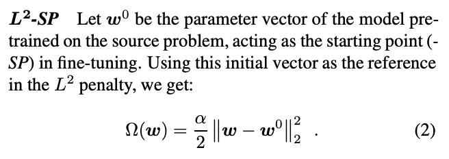
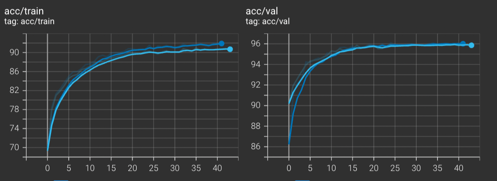

# Report of Fintune

# Menu
- [Report of Fintune](#report-of-fintune)
- [Menu](#menu)
- [Settings](#settings)
- [Results(seperate lr strategy)](#resultsseperate-lr-strategy)
  - [Table](#Table)
  - [Curve](#Curve)
    - [CIFAR10](#cifar10)
    - [CUB200](#cub200)
    - [Imagenet](#imagenet)
- [Strategy Compare](#strategy-compare)
  - [Standard Fine-tuning vs Separate Lr](#standard-fine-tuning-vs-separate-lr)
    - [Result](#result)
    - [CIFAR10](#cifar10-1)
    - [CUB200](#cub200-1)
  - [Seperate Lr vs Fine-tuning last-3](#seperate-lr-vs-fine-tuning-last-3)
    - [CIFAR10](#cifar10-2)
  - [L2-sp](#l2-sp)
- [Train-from-scratch vs Fintune](#train-from-scratch-vs-fintune)
  - [Training for Same Epochs](#training-for-same-epochs)
  - [Training for More Epochs](#training-for-more-epochs)
  - [Difference of Two Sets of Parameters](#difference-of-two-sets-of-parameters)
    - [Cos Similarity of Bias](#cos-similarity-of-bias)


# Settings

Arch: MobileNetV2

Dataset:CIFAR10,CUB200,CAR196,FOOD101,CIFAR100

# Results(seperate lr strategy)

## Table

| Dataset  | Val_acc%(top1) | Test_acc%(top1) |
| -------- | -------------- | --------------- |
| Cifar10  | 96.224         |                 |
| Car196   | 87.295         |                 |
| Food101  | 81.124         |                 |
| Cifar100 | 73.242         |                 |
| CUB200   | 78.141         |                 |
| Imagenet | 70.241         |                 |

## Curve

### CIFAR10

X-axis: epoch

Y-axis: acc%


X-axis: epoch

Y-axis: loss


### CUB200

X-axis: epoch

Y-axis: acc%


X-axis: epoch

Y-axis: loss


### Imagenet

X-axis: epoch

Y-axis: acc%


X-axis: epoch

Y-axis: loss


# Strategy Compare

Since Imagenet is too slow to train, I use CIFAR10 to implement these strategy.All parameters are same, lr, weight decay, and others.

## Standard Fine-tuning vs Separate Lr 

Standard Fine-tuning

```python
                optimizer = torch.optim.Adam(model.parameters(), args.lr,
                                             weight_decay=args.weight_decay)
```

separate lr 

```python
            classifier_map = list(map(id, model.classifier.parameters()))
            low_map = list(map(id, model.features[-5:]))
            classifier_params = filter(lambda p: id(
                p) in classifier_map, model.parameters())
            low_params = filter(lambda p: id(p) in low_map, model.parameters())
            deep_params = filter(lambda p: id(
                p) not in low_map+classifier_map, model.parameters())
            optimizer = torch.optim.Adam([{'params': classifier_params}, {
                                         'params': low_params, 'lr': args.lr*0.6}, {'params': deep_params, 'lr': args.lr*0.4}], lr=args.lr)
```

### Result

### CIFAR10

Blue curve:separate lr 

Orange curve:Standard Fine-tuning


### CUB200

Pink curve: separate lr 

Green curve: Standard Fine-tuning


It could be infer that using seperate lr, which is small lr for deep layers gets better results in validation datasets comparing to Standard Fine-tuning.

Which is similar to this article,https://arxiv.org/pdf/1811.08737.pdf.


## Seperate Lr vs Fine-tuning last-3 

### CIFAR10

green curve:fFine-tuning last-3 

blue curve: seperate lr


No doubt Fine-tuning last-3 is a bad choice for MobileNetV2 in CIFAR!

## L2-sp

https://arxiv.org/pdf/1802.01483.pdf

The article above shows that when we use L2 normalization in fin tune. We might need to change its form.



So I rewrite optimizer

```python
class l2sp(Optimizer):
    def __init__(self, params, lr=1e-3, betas=(0.9, 0.999), eps=1e-8,
                weight_decay=0, amsgrad=False):
        defaults = dict(lr=lr, betas=betas, eps=eps,
                        weight_decay=weight_decay, amsgrad=amsgrad)
        self.oldparam = params
        super(l2sp, self).__init__(params, defaults)

    def __setstate__(self, state):
        super(l2sp, self).__setstate__(state)
        for group in self.param_groups:
            group.setdefault('amsgrad', False)

    @torch.no_grad()
    def step(self, closure=None):
        loss = None
        if closure is not None:
            with torch.enable_grad():
                loss = closure()

        for group in self.param_groups:
            params_with_grad = []
            grads = []
            old_params_with_grad = []
            for p in group['params']:
                if p.grad is not None:
                    params_with_grad.append(p)
                    if p.grad.is_sparse:
                        raise RuntimeError(
                            'Adam does not support sparse gradients, please consider SparseAdam instead')
                    grads.append(p.grad)
                    state = self.state[p]
                    # Lazy state initialization
                    if len(state) == 0:
                        state['step'] = 0
                
            for q in self.oldparam:
                if q.grad is not None:
                    old_params_with_grad.append(p)


            l2sp_adam(params_with_grad,
                   grads,
                   lr=group['lr'],
                   weight_decay=group['weight_decay'],
                   l2sp = old_params_with_grad)
        return loss
def l2sp_adam(params: List[Tensor],
         grads: List[Tensor],
         lr: float,
         weight_decay: float,
          l2sp=0):

    for i, param in enumerate(params):

        grad = grads[i]

        if weight_decay != 0 and l2sp != 0:
            grad = grad.add(l2sp[i], alpha=weight_decay)


        step = grad * lr 
        param.add_(step)
```

It shows really good results. In CIFAR10, this technique helps improve a lot comparing to seperate lr! :)

It could be regarded as L1 and L2 normalization.( which L1 has a special value)

Light Blue curve: L2-sp

blue curve : seperate lr



# Train-from-scratch vs Fintune

In this section, I choose the different layer with seperate lr fintune method shown above.

## Training for Same Epochs

red curve: train-from-scratch

Blue curve: fintune


Using same learning rate decay strategy(exp decay), we can not get similar results.

## Training for More Epochs

However, when I try to continue training, it seems to stop to grow.


Then I try to use these two sets of parameters to analyze the difference.

## Difference of Two Sets of Parameters

### Cos Similarity of Bias


It shows that ony classifier bias of training from scratch is similar to fintune model parameters.

However I still need a technique to analyse weight(tensors), it is to be done
