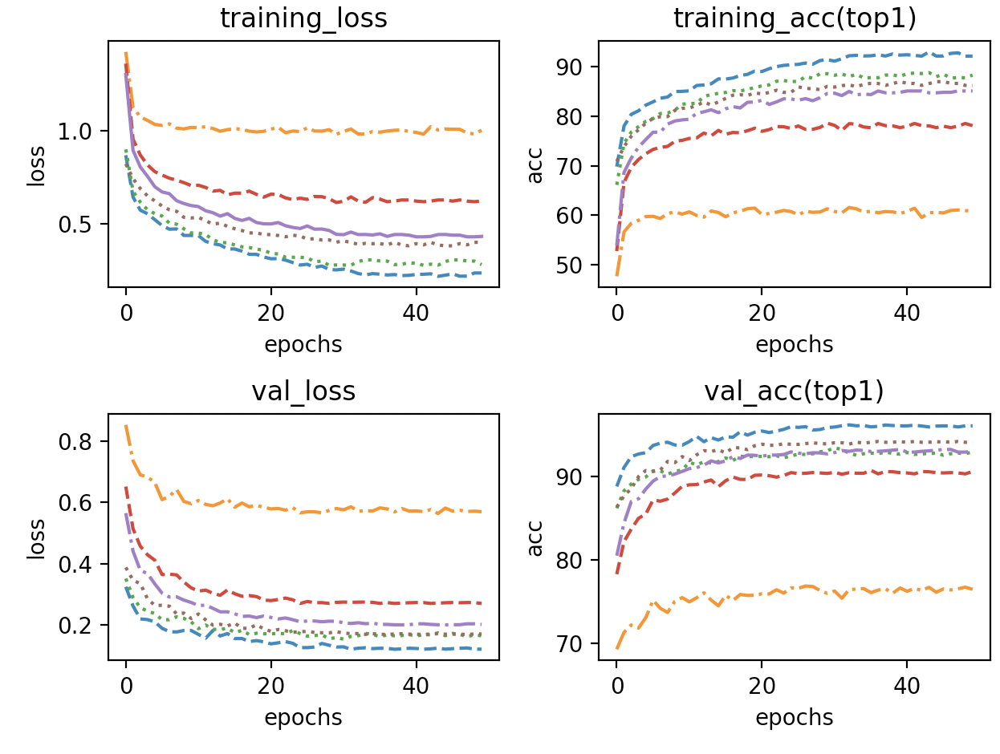
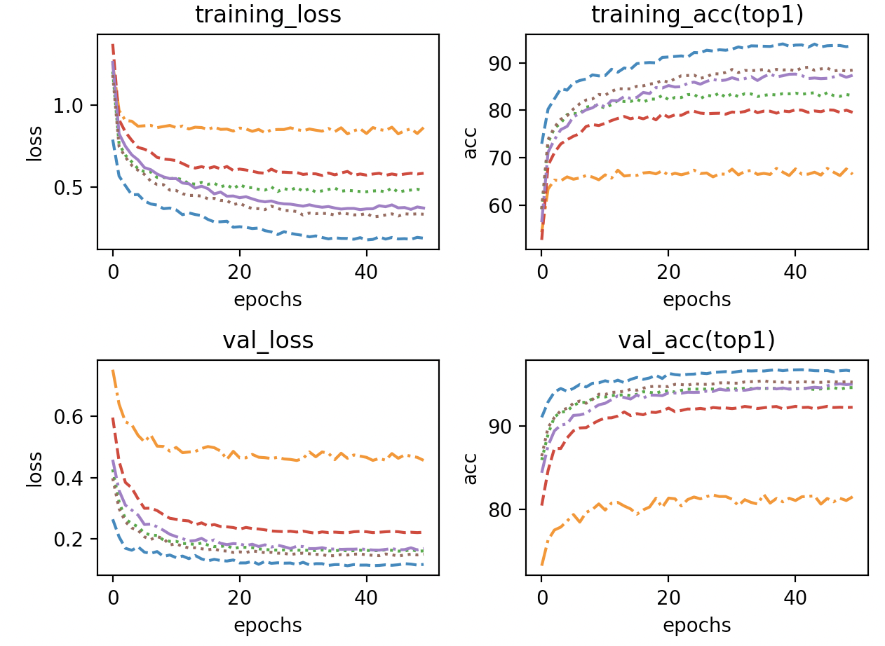

# TinyTL

## 1 Setup

## 1.1 Dataset

Following the common practice, I use ImageNet as the pretraining dataset and transfer it to the CIFAR10 classification task. I use parameters provided on torchvision.

## 1.2 Model Architecture

TInyTL only provides ProxylessNAS-Mobile, I choose MobileNetV2 as my backbone. Also, I test ProxylessNAS-Mobile on my training settings, too. For each InvertedResidual Block, I inserted with a lite residual module presented in https://proceedings.neurips.cc/paper/2020/file/81f7acabd411274fcf65ce2070ed568a-Paper.pdf. The group size is 2, and the kernel size is 3. The residual module code is shown below.

```python
class LiteResidualModule(nn.Module):

    def __init__(self, main_branch, in_channels, out_channels,
                 expand=1.0, kernel_size=3, act_func='relu', n_groups=2,
                 downsample_ratio=2, upsample_type='bilinear', stride=1):
        super(LiteResidualModule, self).__init__()
        self.main_branch = main_branch
        self.lite_residual_config = {
            'in_channels': in_channels,
            'out_channels': out_channels,
            'expand': expand,
            'kernel_size': kernel_size,
            'act_func': act_func,
            'n_groups': n_groups,
            'downsample_ratio': downsample_ratio,
            'upsample_type': upsample_type,
            'stride': stride,
        }
        kernel_size = 1 if downsample_ratio is None else kernel_size
        padding = get_same_padding(kernel_size)
        pooling = nn.AvgPool2d(downsample_ratio, downsample_ratio, 0)
        num_mid = make_divisible(int(in_channels * expand), divisor=8)
        self.lite_residual = nn.Sequential(OrderedDict({
            'pooling': pooling,
            'conv1': nn.Conv2d(in_channels, num_mid, kernel_size, stride, padding, groups=n_groups, bias=False),
            'bn1': nn.BatchNorm2d(num_mid),
            'act': build_activation(act_func),
            'conv2': nn.Conv2d(num_mid, out_channels, 1, 1, 0, bias=False),
            'final_bn': nn.BatchNorm2d(out_channels),
        }))
        init_models(self.lite_residual)
        self.lite_residual.final_bn.weight.data.zero_()
        for param in self.lite_residual.parameters():
            param.requires_grad = True

    def forward(self, x):
        main_x = self.main_branch(x)
        lite_residual_x = self.lite_residual(x)
        if self.lite_residual_config['downsample_ratio'] is not None:
            lite_residual_x = F.upsample(lite_residual_x, main_x.shape[2:],
                                         mode=self.lite_residual_config['upsample_type'])
        return main_x + lite_residual_x
```

To implement it, I design an API function for inserting lite residual for all InverseResidual Blocks in MobileNetV2.

```python
    @staticmethod
    def insert_lite_residual(net, downsample_ratio=2, upsample_type='bilinear',
                             expand=1.0, max_kernel_size=3, act_func='relu', n_groups=2,
                             **kwargs)

```

Also, I changed bn to gn for small batchs training.

```python
replace_bn_with_gn(net, gn_channel_per_group=8)
```


## 1.3 Training Details

| setting                                       | value                                                        |
| --------------------------------------------- | ------------------------------------------------------------ |
| Pretrained dataset                            | Imagenet                                                     |
| Dataset                                       | CIFAR10                                                      |
| Epochs                                        | 50                                                           |
| Optimizer                                     | Adam                                                         |
| Lr(initial)                                   | 3e-4                                                         |
| Scheduler                                     | CosineAnnealingLR                                            |
| Batch size                                    | 8                                                            |
| Weight decay                                  | 1e-4                                                         |
| Distributed                                   | No                                                           |
| Backbone                                      | MobileNetV2, ProxylessNAS-Mobile                             |
| Weight Initialization for Lite Residual Model | Random Weights（MobileNetV2)/hanlab pretrained(ProxyNas-Mobile) |


## 1.4 Usage

### 1.4.1 File structure

```
├── README.md
├── pic
└── train
    ├── dataset
    │   └── dataset_collection.py
    ├── gradient_checkpoint
    │   ├── example.py
    │   └── utils.py
    ├── train.py
    ├── utils.py
    └── vision
        ├── draw_plot.py
        ├──utils.py
```

### 1.4.2 Command

Training file stores in ./train/train.py.

```
usage: train.py [-h] [--a ARCH] [-j N] [--epochs N] [--start-epoch N] [-b N]
                [--lr LR] [--momentum M] [--wd W] [-p N] [--resume PATH] [-e]
                [--pretrained] [--world-size WORLD_SIZE] [--rank RANK]
                [--dist-url DIST_URL] [--dist-backend DIST_BACKEND]
                [--seed SEED] [--gpu GPU] [--multiprocessing-distributed]
                [-type DATASET_TYPE] [--gamma GAMMA] [--tensorboard]
                [--train-method {deep,low,finetune,bias,TinyTL-L,TinyTL-B,TinyTL-L+B,norm+last}]
                [--proxy]
                DIR
```

Print command below for more information

```
python train.py -h
```

### 1.4.3 Example

Command examples are stored in `./train_script/` . Refer to distributed.sh for more informations.

## 2 Main Results

### 2.1 Table

FT-Last: only the last layer is being finetuned other parameters are frozen.

TinyTL-B: only finetune bias and last layer

TinyTL-L: only finetune lite residual model and last layer

TinyTL-L+B: finetune lite residual model and last layer as well as bias in each layer

FT-Norm+Last: finetune last layer and group normalizations

FT-Full: finetune full layers

Resolution: 224

#### 2.1.1 MobileNetV2

| Method       | Dataset | Memory cost | Train accuracy(top1) |
| ------------ | ------- | ----------- | -------------------- |
| FT-Last      | CIFAR10 | 990MB       | 76.37%               |
| TinyTL-B     | CIFAR10 | 756MB       | 90.76%               |
| TinyTL-L     | CIFAR10 | 775MB       | 93.26%               |
| TinyTL-L+B   | CIFAR10 | 799MB       | 94.22%               |
| FT-Norm+Last | CIFAR10 | 1004MB      | 93.44%               |
| FT-Full      | CIFAR10 | 1298MB      | 96.16%               |

#### 2.1.2 ProxylessNAS-Mobile

| Method       | Dataset | Memory cost | Train accuracy(top1) |
| ------------ | ------- | ----------- | -------------------- |
| FT-Last      | CIFAR10 | 613MB       | 81.74%               |
| TinyTL-B     | CIFAR10 | 442MB       | 93.01%               |
| TinyTL-L     | CIFAR10 | 471MB       | 95.05%               |
| TinyTL-L+B   | CIFAR10 | 486MB       | 95.93%               |
| FT-Norm+Last | CIFAR10 | 639MB       | 94.64%               |
| FT-Full      | CIFAR10 | 712MB       | 96.80%               |


### 2.2 Curve

#### 2.2.1 MobileNet




Top1 accuracy, loss of different transfer learning methods. TinyTL-L and TinyTL-L+B have similar results with Finetune Full layers. They outperform FT-Norm+Last.

#### 2.2.2 ProxyNAS-Mobile




The result is within 0.5% accuracy compared to the paper(except for FT-Last, which is about 2%). Similar to MobileNetV2, the rank of each finetune strategy is the same. However, ProxyNas-Mobile is about 2% higher than MobileNetV2 in most strategies(except in FT-Last).

### 2.3 command

Command examples are stored in `./train_script/` .Refer to  `MobileNetV2.sh` and   `ProxyNasMobile.sh` for more informations.

## 3 Conclusion

TinyTL is a sufficient way of fine-tuning with a little sacrifice. It provides an idea that freezes most parameters to save activation memory and uses downsample techniques to save training memory. Also, adding residual block is a way of providing a new backbone of the model, which supports its accuracy.

# Gradient Checkpoint

## 1 Setup

I use two PyTorch mechanisms to implement gradient checkpoint. The first one is provided by the official PyTorch https://pytorch.org/docs/stable/checkpoint.html. And the second way is to use a `torch.autograd.Function`. As for this gradient checkpoint, it is analyzed in this paper https://arxiv.org/abs/1604.06174.

## 2 Code and Usage

Two implementations are shown below

### 2.1 Checkpoint Package

```python
class checkpoint_segment(nn.Module):
    def __init__(self, segment) -> None:
        super(checkpoint_segment, self).__init__()
        self.segment = segment

    def forward(self, x):
        if x.requires_grad == False:
            print("could not use checkpoint at this segment")
        x = checkpoint(self.segment, x)
        return x

    @staticmethod
    def insert_checkpoint(segment):
        segment = checkpoint_segment(segment)
        return segment
```

As for Usage, 

```python
model_segment = checkpoint_segment.insert_checkpoint(model_segment)
```

`model_segment` is the part that you need to set checkpoint, you could see `./train/gradient_checkpoint/example.py` for more informations.

### 2.2 Autograd Implementation

```python
class CheckpointFunction(torch.autograd.Function):
    @staticmethod
    def forward(ctx, run_function, length, *args):
        ctx.run_function = run_function
        ctx.input_tensors = list(args[:length])
        ctx.input_params = list(args[length:])
        with torch.no_grad():
            output_tensors = ctx.run_function(*ctx.input_tensors)
        return output_tensors

    @staticmethod
    def backward(ctx, *output_grads):
        for i in range(len(ctx.input_tensors)):
            temp = ctx.input_tensors[i]
            ctx.input_tensors[i] = temp.detach()
            ctx.input_tensors[i].requires_grad = temp.requires_grad
        with torch.enable_grad():
            output_tensors = ctx.run_function(*ctx.input_tensors)
        input_grads = torch.autograd.grad(
            output_tensors, ctx.input_tensors + ctx.input_params, output_grads, allow_unused=True)
        return (None, None) + input_grads
```

As for Usage

```python
CheckpointFunction.apply(run_function,input,args)
```

run_function is a `torch.utils.Function` object, `input` is input tensors for this function, `args` are others you need when in backward(could be ignored).

## 3 Results

I use MobileNetV2 as my backbone, Also, I set checkpoints at each InversResidual Block. You could see more information in `./train/gradient_checkpoint/example.py`.

| Batch size | Memory cost(without checkpoint) | Memory cost(with checkpoint) |
| ---------- | ------------------------------- | ---------------------------- |
| 1          | 821MB                           | 817MB                        |
| 8          | 1318MB                          | 912MB                        |
| 16         | 2105MB                          | 1393MB                       |
| 32         | 3541MB                          | 2119MB                       |
| 64         | 7492MB                          | 3291MB                       |

