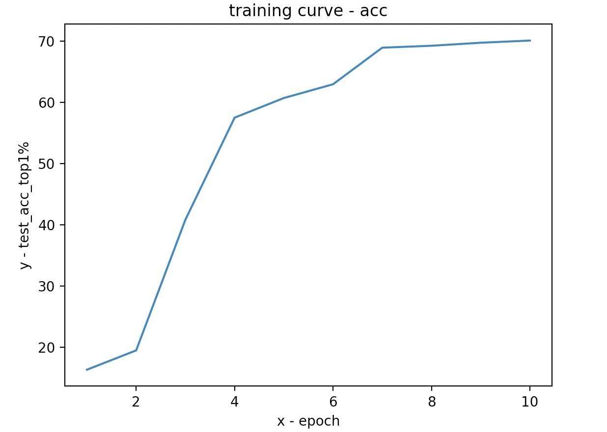
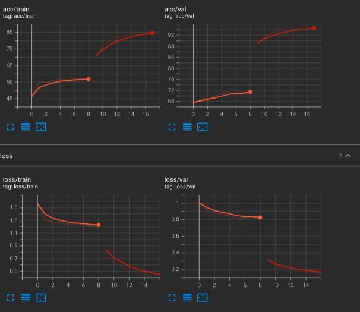
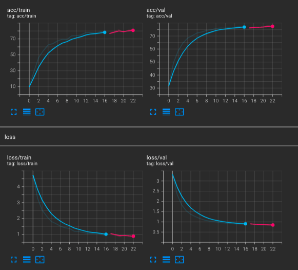
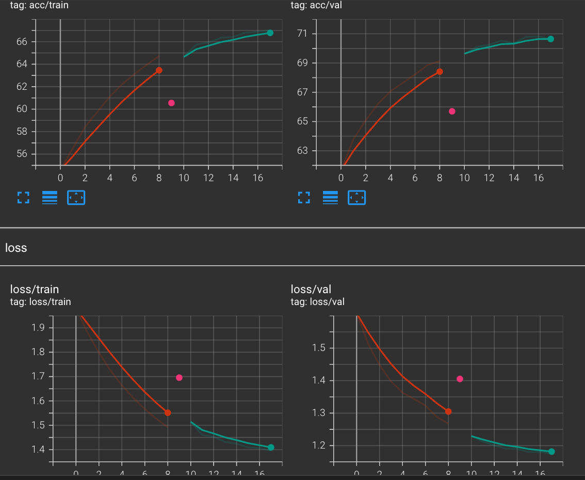

# report about fintune

# settings

1. Model: All models in torchvision(pertained in torchvision)
2. Dataset: food101,bird200(CUB), car196, cifar10, cifar100,Imagenet
3. currently support mobilenet_v2 and all datasets above
4. code stored in ./train/train.py

# structure
```
.
└── train
    ├── dataset
    │   └── dataset_collection.py
    ├── train.py
    ├── utils.py
    └── vision
        └── vision_class.py
```
vision_class.py for some helper functions and visualizition\
dataset_collecton.py for generate datasets for food101,bird200(CUB), car196, cifar10, cifar100,Imagenet
# training
## single node, multiple GPUs:
```
python ./train/train.py -a mobilenet_v2 --pretrained --dist-url 'tcp://127.0.0.1:1234' --dist-backend 'nccl' --multiprocessing-distributed --world-size 1 --rank 0  --seed 1 -t Imagenet --tensorboard [path_to_Imagenet_dataset]
```
## multiple nodes:
### node 0:
```
python main.py -a mobilenet_v2 --pretrained --dist-url 'tcp://127.0.0.1:1234' --dist-backend 'nccl' --multiprocessing-distributed --world-size 2 --rank 0 [imagenet-folder with train and val folders]
```
### node 1:
```
python main.py -a mobilenet_v2 --pretrained --dist-url 'tcp://127.0.0.1:1234' --dist-backend 'nccl' --multiprocessing-distributed --world-size 2 --rank 1 [imagenet-folder with train and val folders]
```
# usage

```
usage: train.py [-h] [-a ARCH] [-j N] [--epochs N] [--start-epoch N] [-b N]
                [--lr LR] [--momentum M] [--wd W] [-p N] [--resume PATH] [-e]
                [--pretrained] [--world-size WORLD_SIZE] [--rank RANK]
                [--dist-url DIST_URL] [--dist-backend DIST_BACKEND]
                [--seed SEED] [--gpu GPU] [--multiprocessing-distributed]
                [-type DATASET_TYPE] [--gamma GAMMA] [--tensorboard]
                [--train-method {deep,low,fintune}]
                DIR
```

# example
```
python ./train/train.py -a mobilenet_v2 --pretrained --dist-url 'tcp://127.0.0.1:1234' --dist-backend 'nccl' --multiprocessing-distributed --world-size 1 --rank 0  --seed 1 -t Imagenet --tensorboard [path_to_Imagenet_dataset]
```
using pretrained mobilenet_v2 training on Imagenet dataset

# results

| Dataset  | Val_acc%(top1)             | Test_acc%(top1) |
| -------- | -------------------------- | --------------- |
| Cifar10  | 95.11                 |           |
| Car196   | 87.295                     |                 |
| Food101  | 80.124 |                 |
| Cifar100 | 71.242(to be done)         | 70.411          |
| CUB200   | 72.141                     |                 |
| Imagenet | 71.095                     |                 |
# curve(imagenet)




# tensorboard(example)

## Cifar10 



## CUB200:



## Imagenet




1. Learning rate decay

```python
scheduler = torch.optim.lr_scheduler.ExponentialLR(optimizer,gamma = 0.95)
......
scheduler.step()
```

2. weight decay

```python
optimizer = torch.optim.Adam(net.module.parameters(),lr = lr_init,weight_decay=weight_decay)
```

prevent overfit in car and birds but not that useful in food

3. K-folder(should have test datas)

```python
for fold,(train_idx,test_idx) in enumerate(kfold.split(dataset)):
  print('------------fold no---------{}----------------------'.format(fold))
  train_subsampler = torch.utils.data.SubsetRandomSampler(train_idx)
  test_subsampler = torch.utils.data.SubsetRandomSampler(test_idx)
 
  trainloader = torch.utils.data.DataLoader(
                      dataset, 
                      batch_size=batch_size, sampler=train_subsampler)
  testloader = torch.utils.data.DataLoader(
                      dataset,
                      batch_size=batch_size, sampler=test_subsampler)
```

4. different learning rate on each layer

```python
optimizer = torch.optim.Adam([{'params':classifier_params},{'params':low_params,'lr':lr_init*0.6},{'params':deep_params,'lr':lr_init*0.4}],lr=lr_init)
```

# more details
1. support more specific training method 

fintune:
```python
for param in model.parameters():
    param.requires_grad = False
for param in model.classifier.parameters():
    param.requires_grad = True
optimizer = torch.optim.Adam(model.parameters(), args.lr,
                              weight_decay=args.weight_decay)
```
low:
```python
classifier_map = list(map(id, model.classifier.parameters()))
low_map = list(map(id, model.features[-5:]))
classifier_params = filter(lambda p: id(
    p) in classifier_map, model.parameters())
low_params = filter(lambda p: id(p) in low_map, model.parameters())
deep_params = filter(lambda p: id(
    p) not in low_map+classifier_map, model.parameters())
optimizer = torch.optim.Adam([{'params': classifier_params}, {
                              'params': low_params, 'lr': args.lr*0.6}, {'params': deep_params, 'lr': args.lr*0.4}], lr=args.lr)
```
deep: 
```python
for param in model.parameters():
    param.requires_grad = True
    optimizer = torch.optim.Adam(model.parameters(), args.lr,
                                  weight_decay=args.weight_decay)
```

