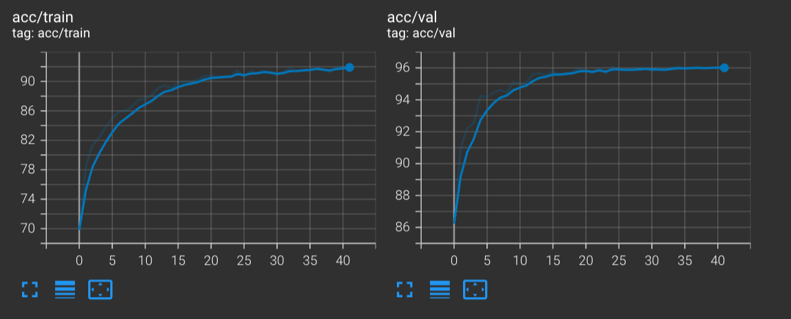
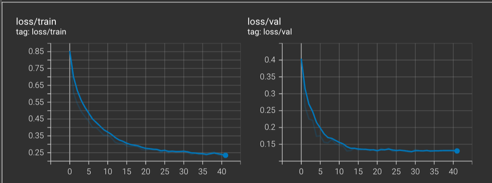
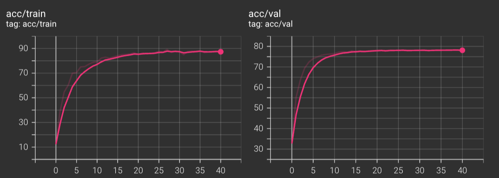
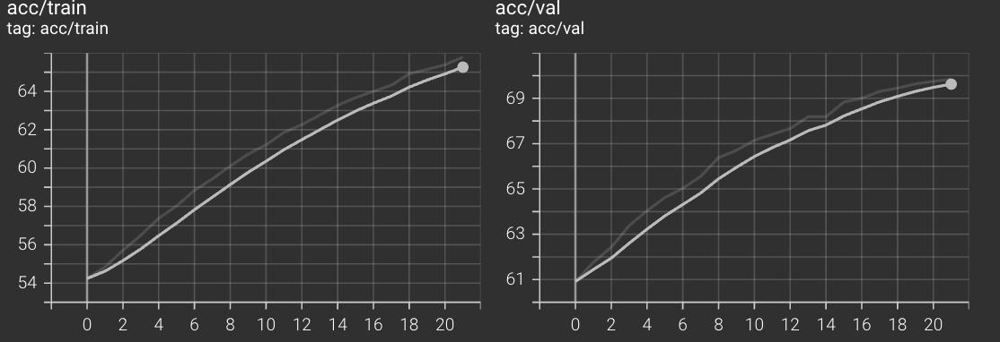
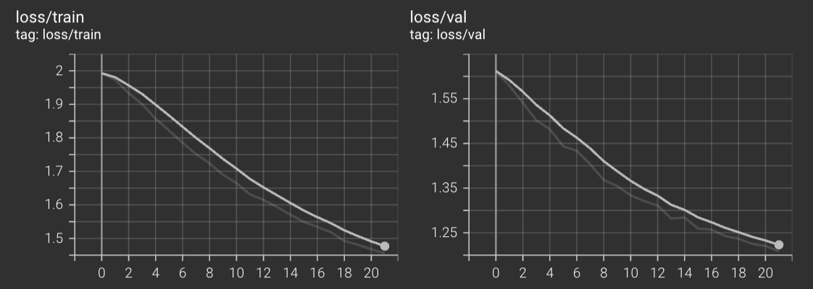
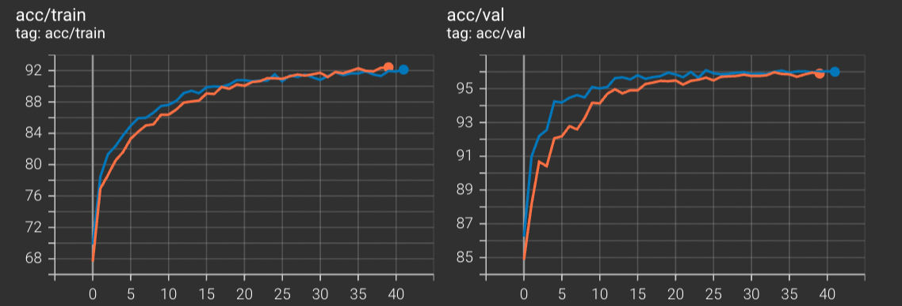
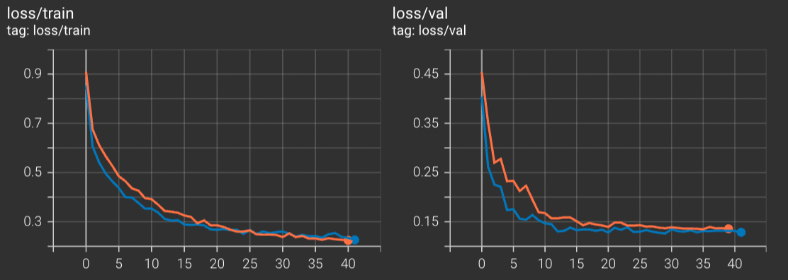

# Report of Fintune


# Settings

Arch: MobileNetV2

Dataset:CIFAR10,CUB200,CAR196,FOOD101,CIFAR100

# Results(best fintun strategy)

## table

| Dataset  | Val_acc%(top1) | Test_acc%(top1) |
| -------- | -------------- | --------------- |
| Cifar10  | 96.224         |                 |
| Car196   | 87.295         |                 |
| Food101  | 80.124         |                 |
| Cifar100 | 71.242         |                 |
| CUB200   | 72.141         |                 |

## curve

### CIFAR10

X-axis: epoch

Y-axis: acc%



X-axis: epoch

Y-axis: loss



### CUB200




### Imagenet





# Strategy Compare

Since Imagenet is too slow to train, I use CIFAR10 to implement these strategy.

## same lr in each layer vs separate lr 

Same

```python
                optimizer = torch.optim.Adam(model.parameters(), args.lr,
                                             weight_decay=args.weight_decay)
```

Different

```python
            classifier_map = list(map(id, model.classifier.parameters()))
            low_map = list(map(id, model.features[-5:]))
            classifier_params = filter(lambda p: id(
                p) in classifier_map, model.parameters())
            low_params = filter(lambda p: id(p) in low_map, model.parameters())
            deep_params = filter(lambda p: id(
                p) not in low_map+classifier_map, model.parameters())
            optimizer = torch.optim.Adam([{'params': classifier_params}, {
                                         'params': low_params, 'lr': args.lr*0.6}, {'params': deep_params, 'lr': args.lr*0.4}], lr=args.lr)
```

### result

## CIFAR10

Blue curve:different

Orange curve:same






It could be infer that using different lr at different layer, which is small lr for deep layers gets better results in validation datasets comparing to same lr for all layers.

Which is similar to this article,https://arxiv.org/pdf/1811.08737.pdf.

