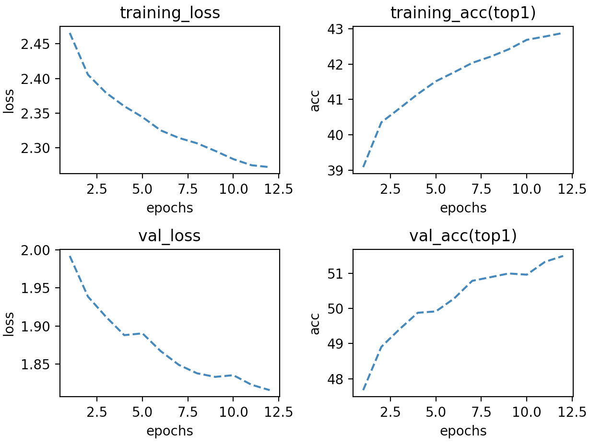

# 1 Batchsize vs accuracy

## 1.1 Theory

There are mainly two reasons that constrain batch size and accuracy. As for the first reason, our model is trying to solve a non-convex optimization problem that has a lot of local optima. If we choose a large batch size, we could get into local optima easily[1]. Small batch size's loss decays not as steady as the large batch size. Therefore, choosing a small batch size has a smaller possibility to stay at a local optimum.

 

Another reason is that when choosing SGD as our optimizer(if we choose others, we have similar results, too), the backward step of large batch size is not equal to seldom backward steps of small batch size.

If we have a minibatch size of n pictures in image classification problems, and a large batch is n times of a minibatch. We could see that the loss functions are different((3) and (4)). We assume η is the learning rate.


If we assume that w_t ≈ w_{t+k} , which means that after each batch's backward parameters change a little, (3) and (4) are the same.

## 1.2 Main Results

### 1.2.1 Settings and Commands

| setting            | value                                       |
| ------------------ | ------------------------------------------- |
| Pretrained dataset | Imagenet                                    |
| Dataset            | CIFAR10                                     |
| Epochs             | 50                                          |
| Optimizer          | Adam                                        |
| Lr(initial)        | Scaling learning rate with batch size       |
| Scheduler          | CosineAnnealingLR                           |
| Batch size         | 32,64,128,256                               |
| Weight decay       | 1e-4                                        |
| Distributed        | Yes                                         |
| Backbone           | MobileNetV2                                 |
| Finetune strategy  | feature extractor(only finetune last layer) |

Refer commands to `./train_scrpit`

 ### 1.2.2 Results

| Batchsize(on 4 GPUs) | Initial learning rate(scaled) | val_acc(top1) |
| -------------------- | ----------------------------- | ------------- |
| 32                   | 3e-4                          | 71.2%         |
| 64                   | 6e-4                          | 75.1%         |
| 128                  | 1.2e-3                        | 73.7%         |
| 256                  | 2.4e-3                        | 73.1%         |


We could conclude that a smaller batch size has a more unstable curve, which relatively has better accuracy. However, in the small-batch(8 pics per GPU), performance is worse than others. This is because MobileNetV2 uses batchnorm_layer. In small batches, these layer has bad performance. Comparing 64, 128, 256, we get that small batches to get relatively better performance than large batches.


# 2 The reason that slow down the speed of training

## 1.1 Theory

One reason is that `torch.backends.cudnn.deterministic.` This will make sure that if settings are the same, the training parameters of models are the same in each step. However, this will decrease training speed. Only manually set random seed will not cause decreases.

The other reason is that workers of data loader. Data are stored at disks. CPU manages them and sends them to GPUs. If bandwidth is small, GPUs calculate fast and wait for data. This is the main reason that slows down the speed.

## 1.2 Main Results

### 1.2.1 Settings and Commands

| Backbone         | MobileNetV2           |
| ---------------- | --------------------- |
| Picture size     | 3\*224\*224           |
| Dataset          | CIFAR10, Place365     |
| Fintune Strategy | Finetune full network |

Refer commands to `./train_scrpit`

### 1.2.2 Results

| Dataset  | CPU workers | batch_size | cudnn.deterministic | cudnn.benchmark | train and load time per batch per GPU | load time per epoch |
| -------- | ----------- | ---------- | ------------------- | --------------- | ------------------------------------- | ------------------- |
| CIFAR10  | 4           | 64         | False               | True            | 0.091s                                | 0.003s              |
| CIFAR10  | 4           | 128        | False               | True            | 0.160s                                | 0.006s              |
| CIFAR10  | 1           | 256        | False               | True            | 0.285s                                | 0.012s              |
| CIFAR10  | 4           | 256        | False               | True            | 0.283s                                | 0.012s              |
| CIFAR10  | 8           | 256        | False               | True            | 0.294s                                | 0.023s              |
| CIFAR10  | 16          | 256        | False               | True            | 0.313s                                | 0.045s              |
| CIFAR10  | 32          | 256        | False               | True            | 0.364s                                | 0.095s              |
| CIFAR10  | 32          | 256        | False               | False           | 0.360s                                | 0.090s              |
| CIFAR10  | 32          | 256        | True                | False           | 0.363s                                | 0.091s              |
| Place365 | 4           | 256        | False               | True            | 2.86s                                 | 0.912s              |
| Place365 | 8           | 256        | False               | True            | 2.21s                                 | 0.602s              |
| Place365 | 16          | 256        | False               | True            | 1.56s                                 | 0.394s              |
| Place365 | 32          | 256        | False               | True            | 1.12s                                 | 0.344s              |
| Place365 | 32          | 256        | True                | False           | 1.68s                                 | 0.412s              |

We could see that a relatively bigger batch size performs faster. Also, CPU workers could benefit load time. Also, `cudnn.deterministic` and `cudnn.benchmark` affects a lot about performance. In small datasets(such as CIFAR10), these elements affect little about performance speed. In large datasets, these affect a lot.

# 3 Finetune Mobilenet with Place365

## 3.1 Settings and Command

| setting            | value                 |
| ------------------ | --------------------- |
| Pretrained dataset | Imagenet              |
| Dataset            | Place365              |
| Epochs             | 13                    |
| Optimizer          | Adam                  |
| Lr(initial)        | 5e-4                  |
| Scheduler          | CosineAnnealingLR     |
| Batch size         | 256                   |
| Weight decay       | 1e-4                  |
| Distributed        | Yes                   |
| Backbone           | MobileNetV2           |
| Finetune strategy  | Finetune full network |

Command:

```
python train.py --a mobilenet_v2 --dist-url 'tcp://127.0.0.1:1234' --dist-backend 'nccl' --multiprocessing-distributed --world-size 1 --rank 0 --tensorboard --train-method deep  -t Place365 --pretrained --seed 1 ./dataset
```

# 3.2 Result



Val_acc: 51.44%

# Reference

[1] Keskar N S, Mudigere D, Nocedal J, et al. On large-batch training for deep learning: Generalization gap and sharp minima[J]. arXiv preprint arXiv:1609.04836, 2016.

