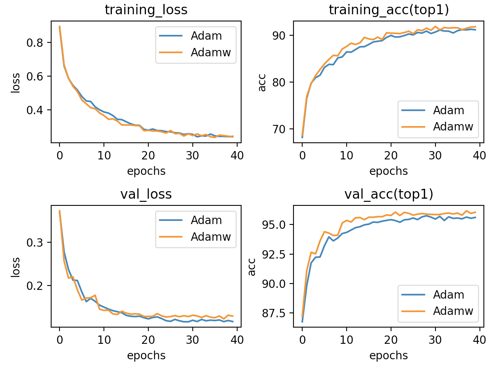

# Report of Finetune

# Menu
- [Report of Finetune](#report-of-finetune)
- [Menu](#menu)
- [Settings](#settings)
- [Results(separate strategy)](#resultsseparate-strategy)
  - [Table](#table)
- [Strategy Compare](#strategy-compare)
  - [Standard Fine-tuning vs Separate Lr](#standard-fine-tuning-vs-separate-lr)
    - [Result](#result)
    - [CIFAR10](#cifar10)
    - [CUB200](#cub200)
  - [Separate Lr vs Fine-tuning last-3](#separate-lr-vs-fine-tuning-last-3)
    - [CIFAR10](#cifar10-1)
  - [tinytl, FT-Last(CIFAR10)](#tinytl-ft-lastcifar10)
    - [memory cost](#memory-cost)
    - [curve](#curve)
    - [arch](#arch)
      - [lite-residual](#lite-residual)
      - [original backbone](#original-backbone)
- [Train-from-scratch vs Finetune](#train-from-scratch-vs-finetune)
  - [Train from scratch](#train-from-scratch)
    - [sgd+CosineAnnealingLR](#sgdcosineannealinglr)
    - [Adam+ expdecay](#adam-expdecay)
- [gradient-checkpoint](#gradient-checkpoint)
  - [code](#code)
  - [result](#result-1)


# Settings

Arch: MobileNetV2

Dataset:CIFAR10,CUB200,CAR196,FOOD101,CIFAR100

Strategy: Finetune the whole layer, finetune last-3-layers, feature extractor, tinytl, separate LR

Pretrained model: Imagenet

Method: reinitialize classifiers

# Results(separate strategy)

## Table

| Dataset                     | Val_acc%(top1) |
| --------------------------- | -------------- |
| Cifar10(whole layer & Adam) | 96.224         |
| CIfar10(tinytl & Adam)      | 93.6           |
| Cifar10(bias & Adam)        | 71.2           |
| Cifar10(train-from-scratch) | 94.8           |
| Car196                      | 87.295         |
| Food101                     | 81.124         |
| Cifar100                    | 73.242         |
| CUB200                      | 78.141         |
| Imagenet                    | 70.241         |
|                             |                |

# Strategy Compare

Since Imagenet is too slow to train, I use CIFAR10 to implement these strategys. All parameters are the same, lr, weight decay, and others.

## Standard Fine-tuning(finetune whole layers) vs Separate Lr 

Standard Fine-tuning

```python
                optimizer = torch.optim.Adam(model.parameters(), args.lr,
                                             weight_decay=args.weight_decay)
```

separate lr 

```python
            classifier_map = list(map(id, model.classifier.parameters()))
            low_map = list(map(id, model.features[-5:]))
            classifier_params = filter(lambda p: id(
                p) in classifier_map, model.parameters())
            low_params = filter(lambda p: id(p) in low_map, model.parameters())
            deep_params = filter(lambda p: id(
                p) not in low_map+classifier_map, model.parameters())
            optimizer = torch.optim.Adam([{'params': classifier_params}, {
                                         'params': low_params, 'lr': args.lr*0.6}, {'params': deep_params, 'lr': args.lr*0.4}], lr=args.lr)
```

### Result

### CIFAR10

Blue curve: separate LR 

Orange curve: Standard Fine-tuning


### CUB200

Pink curve: separate LR 

Green curve: Standard Fine-tuning


It could be inferred that using separate LR, which is small or for deep layers gets better results in validation datasets compared to Standard Fine-tuning.

This is similar to this article,https://arxiv.org/pdf/1811.08737.pdf.


## Separate Lr vs Fine-tuning last-3 

### CIFAR10

green curve: Fine-tuning last-3 

blue curve: separate LR


No doubt Fine-tuning last-3 is a bad choice for MobileNetV2 in CIFAR!

## Tinytl, FT-Last(CIFAR10)

### code

```python
class LiteResidualModule(nn.Module):

    def __init__(self, main_branch, in_channels, out_channels,
                 expand=1.0, kernel_size=3, act_func='relu', n_groups=2,
                 downsample_ratio=2, upsample_type='bilinear', stride=1):
        super(LiteResidualModule, self).__init__()
        self.main_branch = main_branch
        self.lite_residual_config = {
            'in_channels': in_channels,
            'out_channels': out_channels,
            'expand': expand,
            'kernel_size': kernel_size,
            'act_func': act_func,
            'n_groups': n_groups,
            'downsample_ratio': downsample_ratio,
            'upsample_type': upsample_type,
            'stride': stride,
        }
        kernel_size = 1 if downsample_ratio is None else kernel_size
        padding = get_same_padding(kernel_size)
        pooling = nn.AvgPool2d(downsample_ratio, downsample_ratio, 0)
        num_mid = make_divisible(int(in_channels * expand), divisor=8)
        self.lite_residual = nn.Sequential(OrderedDict({
            'pooling': pooling,
            'conv1': nn.Conv2d(in_channels, num_mid, kernel_size, stride, padding, groups=n_groups, bias=False),
            'bn1': nn.BatchNorm2d(num_mid),
            'act': build_activation(act_func),
            'conv2': nn.Conv2d(num_mid, out_channels, 1, 1, 0, bias=False),
            'final_bn': nn.BatchNorm2d(out_channels),
        }))
        init_models(self.lite_residual)
        self.lite_residual.final_bn.weight.data.zero_()

    def forward(self, x):
        main_x = self.main_branch(x)
        lite_residual_x = self.lite_residual(x)
        if self.lite_residual_config['downsample_ratio'] is not None:
            lite_residual_x = F.upsample(lite_residual_x, main_x.shape[2:],
                                         mode=self.lite_residual_config['upsample_type'])
        return main_x + lite_residual_x
```


### memory cost

model: MobileNetV2

method: lite-residual

| Method      | activation cost(batch size = 1, n_groups = 2) | activation cost(batch size = 64, n_groups = 2) |
| ----------- | --------------------------------------------- | ---------------------------------------------- |
| FT-Full     | 1756MB                                        | 6225MB                                         |
| TinyTL+last | 849MB                                         | 3125MB                                         |
| FT-Last     | 1157MB                                        | 5426MB                                         |

### curve


### arch

#### lite-residual


#### original backbone


MobileNetV2 has 18 InvertedResidual block, each one is inserted with residual block.


# Train-from-scratch vs Finetune

In this section, I choose the different layers with separate lr finetune method shown above.

## Train from scratch

### sgd+CosineAnnealingLR


Now training accuracy is similiar to fine-tune accuracy(96.1%). 


### Adam+ expdecay


I stop this because in epoch 30, lr<1e-5.

Why Adam is worse than sgd?


You could find that if we get line 6,7,8 into 12


The reason is that, Adam set different parameters with different decay rate, which is not appropriate. However, using Adamw can fix this.



AdamW, with the same parameters, wins 0.6% more accuracy in val_acc.

# gradient-checkpoint

## code

```python
class CheckpointFunction(torch.autograd.Function):
    @staticmethod
    def forward(ctx, run_function, length, *args):
        ctx.run_function = run_function
        ctx.input_tensors = list(args[:length])
        ctx.input_params = list(args[length:])
        with torch.no_grad():
            output_tensors = ctx.run_function(*ctx.input_tensors)
        return output_tensors

    @staticmethod
    def backward(ctx, *output_grads):
        for i in range(len(ctx.input_tensors)):
            temp = ctx.input_tensors[i]
            ctx.input_tensors[i] = temp.detach()
            ctx.input_tensors[i].requires_grad = temp.requires_grad
        with torch.enable_grad():
            output_tensors = ctx.run_function(*ctx.input_tensors)
        input_grads = torch.autograd.grad(output_tensors, ctx.input_tensors + ctx.input_params, output_grads, allow_unused=True)
        return (None, None) + input_grads
```

```python
class checkpoint_segment(nn.Module):
    def __init__(self,segment) -> None:
        super(checkpoint_segment,self).__init__()
        self.segment = segment
    def forward(self,x):
        if x.requires_grad == False:
            print("could not use checkpoint at this segment")
        x = checkpoint(self.segment,x)
        return x
    @staticmethod
    def insert_checkpoint(segment):
        segment = checkpoint_segment(segment)
        return segment
```


## result

Model:MobileNetV2

inputsize:3*224 *224

Implement checkpoint to all InvertedResidual block

| batch_size | memory cost(before) | memory cost(after) |
| ---------- | ------------------- | ------------------ |
| 1          | 923MB               | 877MB              |
| 16         | 2183MB              | 1473MB             |

