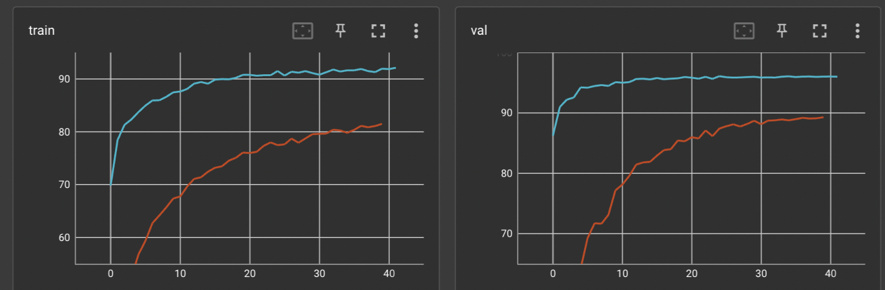

# Report of Finetune

# Menu
- [Report of Finetune](#report-of-finetune)
- [Menu](#menu)
- [Settings](#settings)
- [Results(separate lr strategy)](#resultsseparate-lr-strategy)
  - [Table](#table)
- [Strategy Compare](#strategy-compare)
  - [Standard Fine-tuning vs Separate Lr](#standard-fine-tuning-vs-separate-lr)
    - [Result](#result)
    - [CIFAR10](#cifar10)
    - [CUB200](#cub200)
  - [Seperate Lr vs Fine-tuning last-3](#seperate-lr-vs-fine-tuning-last-3)
    - [CIFAR10](#cifar10-1)
  - [tinytl(CIFAR10)](#tinytlcifar10)
    - [memory cost](#memory-cost)
    - [curve](#curve)
    - [arch](#arch)
      - [lite-residual](#lite-residual)
      - [original backbone](#original-backbone)
- [Train-from-scratch vs Fintune](#train-from-scratch-vs-fintune)
  - [Training for Same Epochs](#training-for-same-epochs)
  - [Training for More Epochs](#training-for-more-epochs)
  - [Difference of Two Sets of Parameters](#difference-of-two-sets-of-parameters)
    - [Cos Similarity of Bias](#cos-similarity-of-bias)


# Settings

Arch: MobileNetV2

Dataset:CIFAR10,CUB200,CAR196,FOOD101,CIFAR100

Strategy: Finetune the whole layer, finetune last-3-layers, feature extractor, tinytl, separate lr

Pretrained model: Imagenet

Method: reinitialize classifiers

# Results(separate lr strategy)

## Table

| Dataset                     | Val_acc%(top1) | Test_acc%(top1) |
| --------------------------- | -------------- | --------------- |
| Cifar10(whole layer & Adam) | 96.224         |                 |
| CIfar10(tinytl & Adam)      | 93.6           |                 |
| Cifar10(bias & Adam)        | 71.2           |                 |
| Car196                      | 87.295         |                 |
| Food101                     | 81.124         |                 |
| Cifar100                    | 73.242         |                 |
| CUB200                      | 78.141         |                 |
| Imagenet                    | 70.241         |                 |
|                             |                |                 |

# Strategy Compare

Since Imagenet is too slow to train, I use CIFAR10 to implement these strategy.All parameters are same, lr, weight decay, and others.

## Standard Fine-tuning vs Separate Lr 

Standard Fine-tuning

```python
                optimizer = torch.optim.Adam(model.parameters(), args.lr,
                                             weight_decay=args.weight_decay)
```

separate lr 

```python
            classifier_map = list(map(id, model.classifier.parameters()))
            low_map = list(map(id, model.features[-5:]))
            classifier_params = filter(lambda p: id(
                p) in classifier_map, model.parameters())
            low_params = filter(lambda p: id(p) in low_map, model.parameters())
            deep_params = filter(lambda p: id(
                p) not in low_map+classifier_map, model.parameters())
            optimizer = torch.optim.Adam([{'params': classifier_params}, {
                                         'params': low_params, 'lr': args.lr*0.6}, {'params': deep_params, 'lr': args.lr*0.4}], lr=args.lr)
```

### Result

### CIFAR10

Blue curve:separate lr 

Orange curve:Standard Fine-tuning


### CUB200

Pink curve: separate lr 

Green curve: Standard Fine-tuning


It could be infer that using seperate lr, which is small lr for deep layers gets better results in validation datasets comparing to Standard Fine-tuning.

Which is similar to this article,https://arxiv.org/pdf/1811.08737.pdf.


## Seperate Lr vs Fine-tuning last-3 

### CIFAR10

green curve:fFine-tuning last-3 

blue curve: seperate lr


No doubt Fine-tuning last-3 is a bad choice for MobileNetV2 in CIFAR!

## tinytl(CIFAR10)

### memory cost

Batchsize = 1,model: MobileNetV2

| Method      | activation cost(batch size = 1, n_groups = 2) | activation cost(batch size = 64, n_groups = 2) |
| ----------- | --------------------------------------------- | ---------------------------------------------- |
| FT-Full     | 1756MB                                        | 6225MB                                         |
| TinyTL+last | 815MB                                         | 3125MB                                         |
| FT-Last     | 1157MB                                        | 5426MB                                         |

### curve


### arch

#### lite-residual


#### original backbone


# Train-from-scratch vs Fintune

In this section, I choose the different layer with seperate lr fintune method shown above.

## Training for Same Epochs

red curve: train-from-scratch

Blue curve: fintune




Using same learning rate decay strategy(exp decay), we can not get similar results.

## Training for More Epochs

However, when I try to continue training, it seems to stop to grow.


Then I try to use these two sets of parameters to analyze the difference.

## Difference of Two Sets of Parameters

### Cos Similarity of Bias


It shows that ony classifier bias of training from scratch is similar to fintune model parameters.

However I still need a technique to analyse weight(tensors), it is to be done
